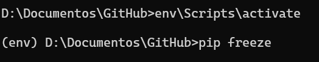

# Ejercicio - Crear un paquete

En este ejercicio, aprenderás a utilizar entornos virtuales como una forma para no afectar a los paquetes instalados globalmente u otros programas que se ejecutan en tu máquina.

*Para este ejercicio es necesario que lo ejecutes desde la terminal, línea de comandos, cmd, consola, cli, etc. de tu computadora, sé que es desafíante, pero no te preocupes ¡¡Sé que puedes lograrlo!!*

## Crear un entorno virtual

1. Creando entorno virtual

   
2. Accediendo a entorno virtual y listando bibliotecas

   
3. Instalando biblioteca

   
4. Listando bibliotecas

   
5. Ejecutando app.py

   
6. Salida de entorno virtual

   
